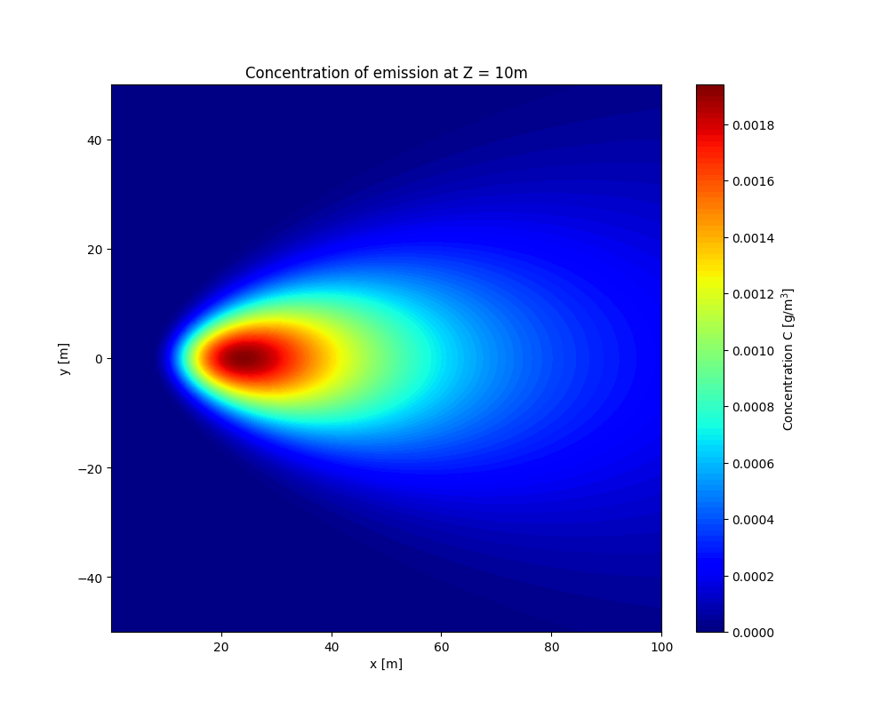

# Gaussian Air Dispersion

The **Gaussian Air Dispersion** model is a widely used and relatively simple approach to predict the spread of pollutants in the air. You can read more about it on this [Wikipedia page](https://en.m.wikipedia.org/wiki/Atmospheric_dispersion_modeling#Gaussian_air_pollutant_dispersion_equation). While I couldn't find a straightforward implementation that suited my needs, I decided to create one myself. Below is a simple implementation that you can use.

<div style="text-align: center;">
    
</div>

## Setup

To get started, clone the repository and set up a virtual environment:

```bash
git clone <repository_url>
python -m venv .venv
source .venv/bin/activate
pip install -r requirements.txt
```

## Run Example

Once everything is set up, you can run the example script to see the model in action:

```
python gaussian_air_dispersion.py
```